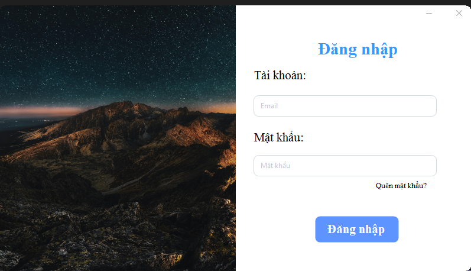
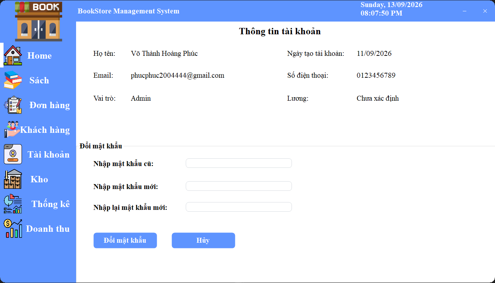
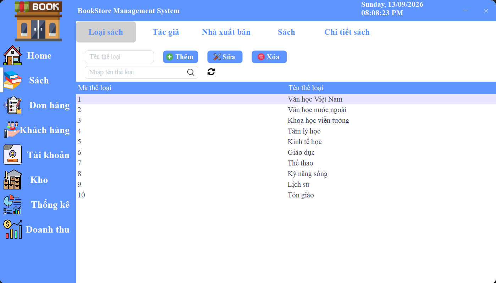
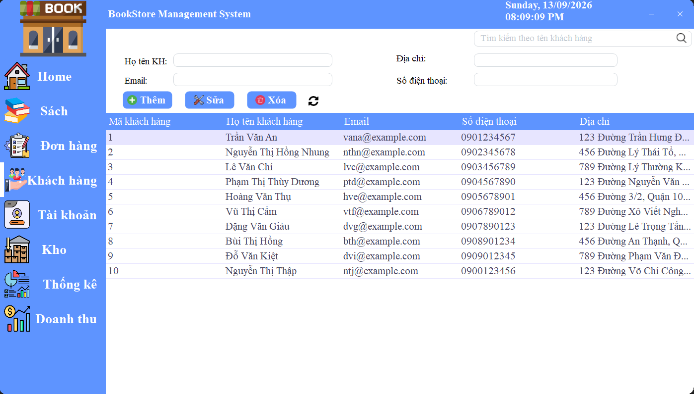
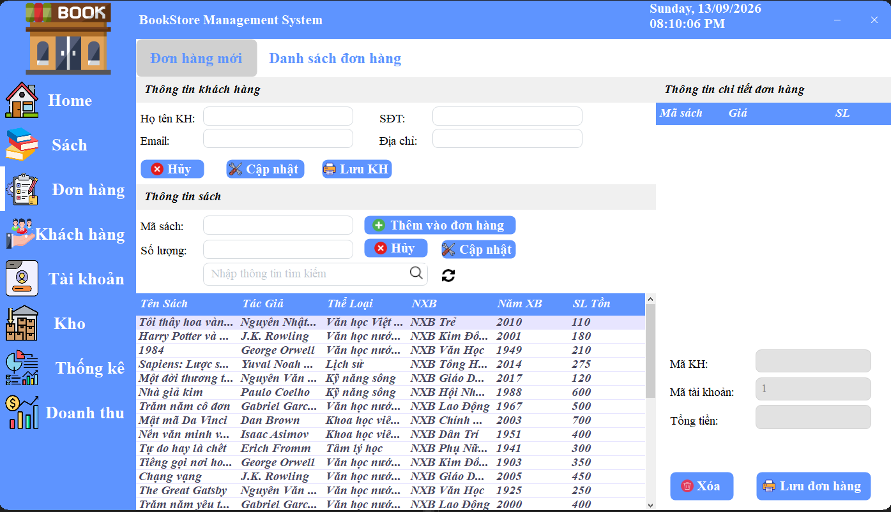
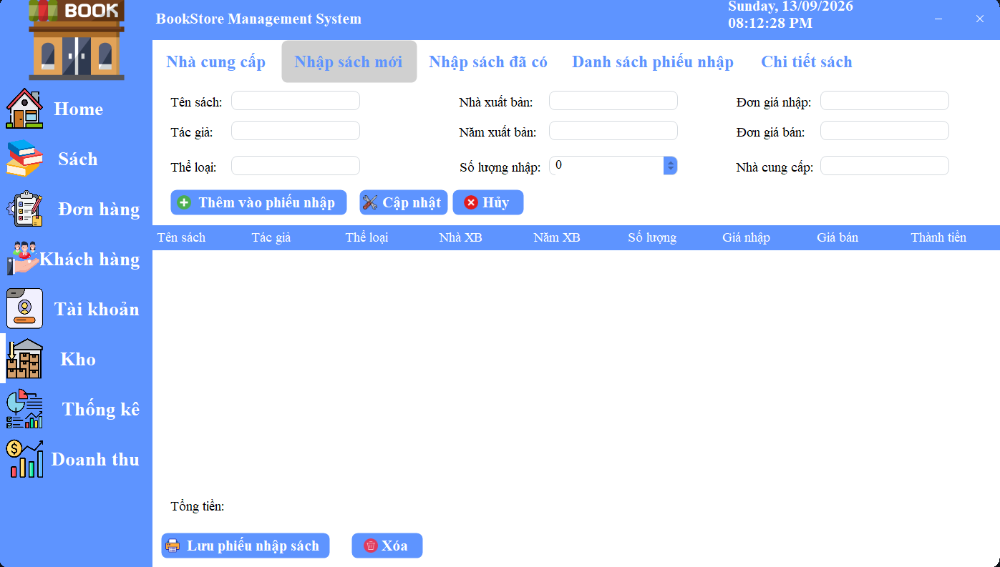
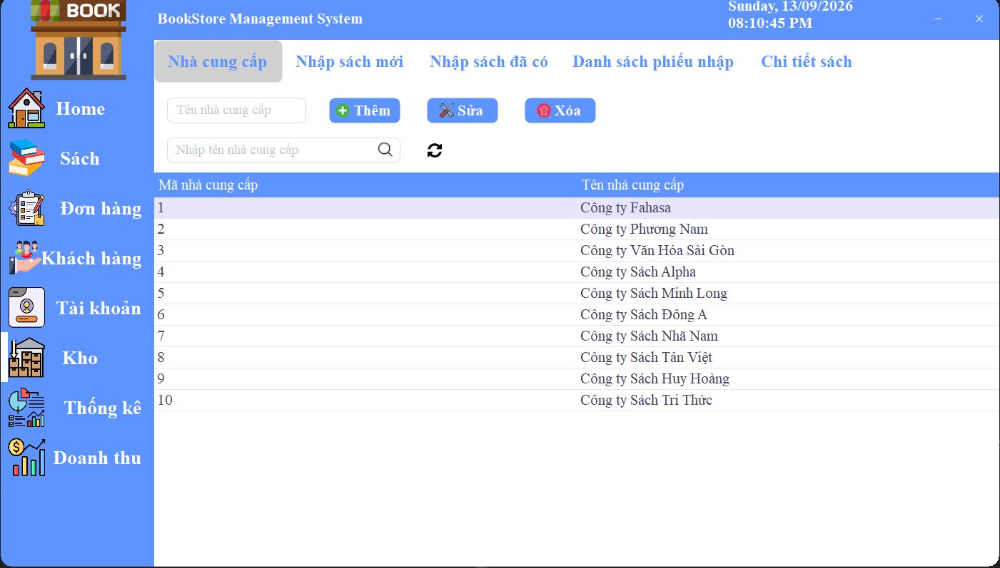
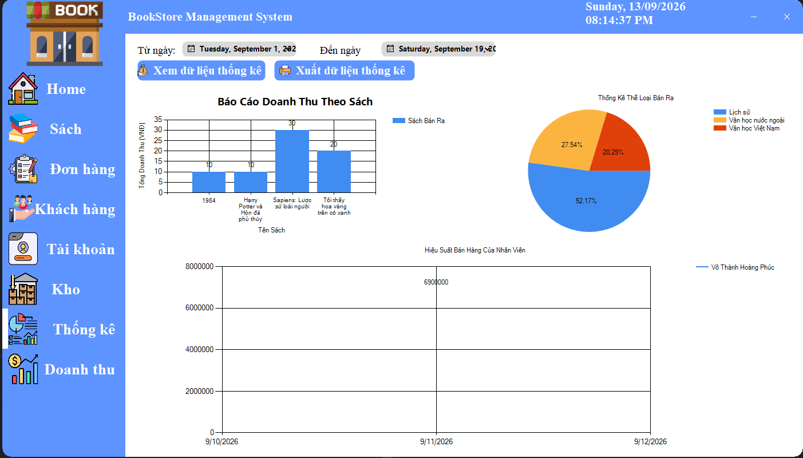
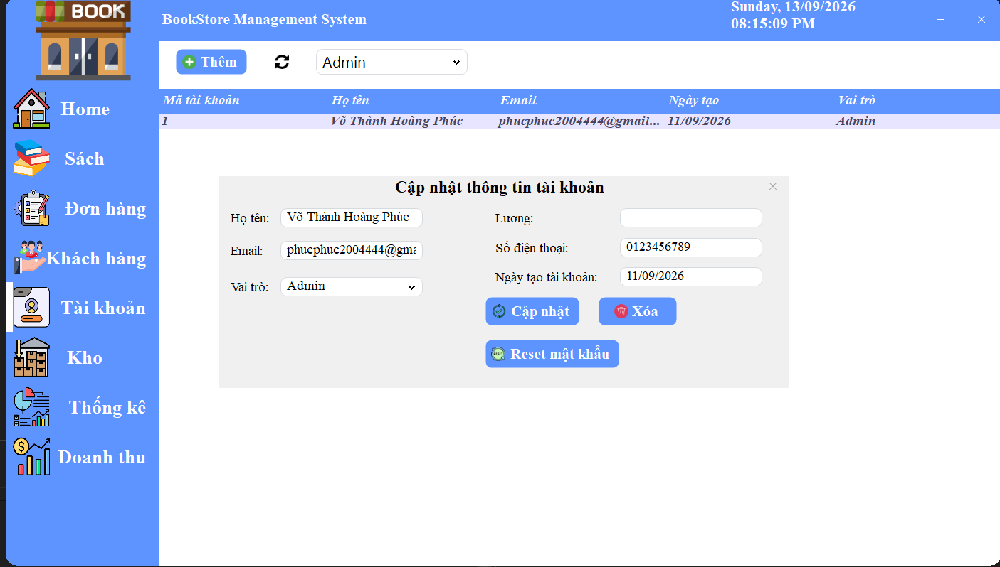

# 📚 BookStore – Phần mềm Quản Lý Cửa Hàng Bán Sách (WinForms C#)

## 1. Giới thiệu

**BookStore** là phần mềm quản lý cửa hàng bán sách được xây dựng bằng **C# – Windows Forms (.NET Framework)** theo mô hình kiến trúc nhiều tầng (3-Layer Architecture).

Hệ thống hỗ trợ quản lý sách, khách hàng, hóa đơn, nhà cung cấp, kho hàng và báo cáo doanh thu một cách trực quan, chính xác và hiệu quả.

Phần mềm phù hợp cho các cửa hàng sách quy mô nhỏ và vừa, mong muốn số hóa quy trình quản lý truyền thống.

---

## 2. Mục tiêu đề tài

- Xây dựng hệ thống quản lý bán sách có tính tự động hóa cao.
- Đơn giản hóa quy trình bán hàng và quản lý kho.
- Cung cấp báo cáo doanh thu theo nhiều tiêu chí.
- Thiết kế giao diện trực quan, dễ sử dụng.
- Nâng cao kỹ năng phát triển ứng dụng WinForms và SQL Server.

---

## 3. Kiến trúc hệ thống

Project được tổ chức theo mô hình **3-Layer Architecture**:

```text
BookStore/
├── BUS/  (Business Logic Layer)
├── DAL/  (Data Access Layer)
├── DTO/  (Data Transfer Object)
├── GUI/  (Graphical User Interface)
└── BookStore.sln
```

### 🔹 DTO (Data Transfer Object)

Định nghĩa các class đại diện cho thực thể:

- Sách
- Khách hàng
- Hóa đơn
- Nhà cung cấp
- Nhân viên
- Tài khoản
- Phiếu nhập
- Chi tiết hóa đơn / chi tiết phiếu nhập

### 🔹 DAL (Data Access Layer)

- Kết nối cơ sở dữ liệu.
- Thực hiện các thao tác CRUD.
- Xử lý truy vấn và tương tác với database.

### 🔹 BUS (Business Logic Layer)

- Xử lý nghiệp vụ.
- Kiểm tra dữ liệu đầu vào.
- Tính toán tổng tiền và doanh thu.
- Cập nhật tồn kho.

### 🔹 GUI (Windows Forms)

- Cung cấp giao diện người dùng.
- Form quản lý sách, hóa đơn và kho.
- Biểu đồ thống kê.
- Xuất báo cáo.

---

## 4. Cấu trúc thư mục ngoại vi

```text
WinForm/
├── BaoCao/      (Chứa file PDF báo cáo)
├── HoaDon/      (Chứa file PDF hóa đơn)
├── PhieuNhap/   (Chứa file PDF phiếu nhập)
├── .gitignore
├── BookStoreDBMoi.sql
├── LICENSE
└── README.md
```

---

## 5. Công nghệ sử dụng

| Thành phần | Công nghệ |
|------------|-----------|
| Ngôn ngữ | C# |
| Nền tảng | Windows Forms (.NET Framework) |
| CSDL | SQL Server |
| Công cụ quản lý CSDL | SQL Server Management Studio |
| Xuất báo cáo | Spire.Office |
| Quản lý mã nguồn | Git |
| Thiết kế UML | StarUML |

---

## 6. Chức năng chính

### 📚 6.1 Quản lý sách

- Thêm / Sửa / Xóa sách.
- Tìm kiếm theo:
  - Tên sách.
  - Tác giả.
  - Thể loại.
- Quản lý tồn kho.
- Lịch sử nhập sách.
- Tính giá nhập trung bình.

### 🧾 6.2 Quản lý hóa đơn (Đơn hàng)

#### Tạo đơn hàng

- Tự động sinh mã đơn.
- Lưu thông tin khách hàng.
- Thêm danh sách sản phẩm.
- Tự động tính tổng tiền.
- Tự động trừ tồn kho.

#### Danh sách đơn hàng

- Tìm kiếm theo:
  - Mã đơn.
  - Tên khách hàng.
  - Số điện thoại.
- Lọc theo ngày.
- Sắp xếp theo giá trị / thời gian.

### 👤 6.3 Quản lý khách hàng

- Thêm / Sửa / Xóa.
- Tìm kiếm nhanh.
- Thống kê doanh thu theo khách hàng.

### 👨‍💼 6.4 Quản lý nhân viên

- Lưu thông tin nhân viên.
- Quản lý ngày bắt đầu làm việc.

### 🔐 6.5 Quản lý tài khoản

- Tạo tài khoản mới.
- Phân quyền sử dụng hệ thống.

### 🏬 6.6 Quản lý kho

#### Nhà cung cấp

- Thêm / Sửa / Xóa.
- Quản lý danh sách nhà cung cấp.

#### Phiếu nhập

- Nhập sách mới.
- Nhập bổ sung sách.
- Lưu lịch sử nhập.
- Xem chi tiết phiếu nhập.

### 📊 6.7 Báo cáo & Thống kê

#### Thống kê tổng quan

- Tổng số đơn hàng.
- Tổng doanh thu.

#### Theo thời gian

- Ngày.
- Tháng.
- Năm.
- Khoảng thời gian tùy chọn.

#### Theo sản phẩm

- Số lượng bán.
- Doanh thu từng sản phẩm.
- Lọc theo thể loại.

#### Theo khách hàng

- Tổng đơn hàng.
- Doanh thu mang lại.

---

## 7. Xuất báo cáo

Hệ thống hỗ trợ xuất dữ liệu dưới nhiều định dạng:

- PDF (`.pdf`)
- Excel (`.xlsx`)
- CSV (`.csv`)

### Nội dung báo cáo bao gồm

- Tổng quan doanh thu.
- Doanh thu theo thời gian.
- Doanh thu theo sản phẩm.
- Doanh thu theo khách hàng.
- Danh sách sản phẩm bán chạy.
- Sản phẩm tồn kho thấp.

Các file được lưu trong:

```text
WinForm/
├── BaoCao/
├── HoaDon/
└── PhieuNhap/
```

---

## 8. Hướng dẫn cài đặt

### Bước 1: Clone repository

```bash
git clone <repository-url>
cd <repository-folder>
```

### Bước 2: Chuẩn bị môi trường

Cài đặt:

- Visual Studio có workload .NET Desktop Development.
- .NET Framework phù hợp với project.
- SQL Server.
- SQL Server Management Studio.

### Bước 3: Khởi tạo cơ sở dữ liệu

1. Mở SQL Server Management Studio.
2. Kết nối đến SQL Server instance.
3. Mở file:

```text
BookStoreDBMoi.sql
```

4. Chạy toàn bộ script.
5. Kiểm tra database, bảng, khóa chính, khóa ngoại và dữ liệu mẫu.

### Bước 4: Cấu hình chuỗi kết nối

Mở file cấu hình trong `DAL` và cập nhật connection string theo SQL Server của máy.

Ví dụ:

```csharp
string connectionString =
    @"Data Source=YOUR_SERVER;
      Initial Catalog=BookStoreDB;
      Integrated Security=True;
      TrustServerCertificate=True;";
```

> Thay `YOUR_SERVER` bằng tên SQL Server instance thực tế. Không commit thông tin đăng nhập hoặc mật khẩu thật vào repository.

### Bước 5: Chạy project

1. Mở `BookStore.sln` bằng Visual Studio.
2. Restore dependencies nếu cần.
3. Build Solution.
4. Chọn project GUI làm Startup Project.
5. Run bằng `F5` hoặc `Ctrl + F5`.

---

## 9. Phạm vi và đối tượng nghiên cứu

- **Đối tượng:** Quy trình quản lý cửa hàng bán sách.
- **Phạm vi:** Ứng dụng desktop trên nền tảng Windows.
- **Đối tượng sử dụng:** Nhân viên bán hàng, quản lý cửa hàng và người quản trị hệ thống.

---

## 10. Kết quả đạt được

- Hệ thống quản lý hoàn chỉnh.
- Giảm sai sót so với quản lý thủ công.
- Hỗ trợ quản lý sách, khách hàng, hóa đơn và kho.
- Báo cáo doanh thu theo nhiều tiêu chí.
- Giao diện trực quan, dễ sử dụng.
- Có thể ứng dụng thực tế cho cửa hàng nhỏ và vừa.

---

# 11. Demo giao diện

Phần này dùng để giới thiệu các màn hình chính của ứng dụng. Các ảnh demo nên được chụp từ phiên bản chạy thực tế và đặt trong thư mục `docs/images/`.

## 11.1. Cấu trúc thư mục ảnh đề xuất

```text
BookStore/
├── docs/
│   └── images/
│       ├── login.png
│       ├── dashboard.png
│       ├── books.png
│       ├── customers.png
│       ├── invoices.png
│       ├── inventory.png
│       ├── suppliers.png
│       ├── reports.png
│       └── account.png
├── README.md
└── ...
```

## 11.2. Trang đăng nhập

Màn hình đăng nhập cho phép người dùng xác thực trước khi truy cập hệ thống.



## 11.3. Màn hình chính / Dashboard

Màn hình tổng quan hiển thị các chức năng chính và các thông tin thống kê quan trọng.



## 11.4. Quản lý sách

Màn hình quản lý sách hỗ trợ thêm, sửa, xóa, tìm kiếm sách và theo dõi thông tin tồn kho.



## 11.5. Quản lý khách hàng

Màn hình quản lý khách hàng hỗ trợ cập nhật thông tin và tra cứu khách hàng.



## 11.6. Quản lý hóa đơn / đơn hàng

Màn hình bán hàng cho phép tạo đơn hàng, thêm sản phẩm, tính tổng tiền và cập nhật tồn kho.



## 11.7. Quản lý kho và nhập sách

Màn hình quản lý kho hỗ trợ quản lý nhà cung cấp, phiếu nhập và lịch sử nhập sách.



## 11.8. Quản lý nhà cung cấp

Màn hình nhà cung cấp cho phép lưu trữ và cập nhật thông tin các đối tác cung ứng sách.



## 11.9. Báo cáo và thống kê

Màn hình báo cáo cung cấp thống kê doanh thu, sản phẩm bán chạy và tình trạng tồn kho.



## 11.10. Quản lý tài khoản và phân quyền

Màn hình tài khoản hỗ trợ tạo tài khoản và phân quyền sử dụng hệ thống.



---

## 12. Hạn chế

- Chỉ hỗ trợ nền tảng Windows.
- Bảo mật còn cơ bản.
- Chưa có phiên bản Web/Mobile.
- Chưa tích hợp thanh toán trực tuyến.
- Khả năng mở rộng và triển khai nhiều người dùng còn phụ thuộc vào cấu hình SQL Server và kiến trúc hiện tại.

---

## 13. Hướng phát triển

- Phát triển phiên bản Web bằng ASP.NET Core.
- Xây dựng ứng dụng Mobile.
- Tích hợp thanh toán online.
- Cải thiện bảo mật bằng mã hóa mật khẩu và phân quyền nâng cao.
- Tối ưu hiệu năng khi dữ liệu lớn.
- Bổ sung logging và audit lịch sử thao tác.
- Xây dựng API để tách giao diện khỏi tầng nghiệp vụ.
- Cân nhắc chuyển sang PostgreSQL hoặc hệ quản trị cơ sở dữ liệu khác khi có nhu cầu triển khai phù hợp.

---

## 14. Phương pháp nghiên cứu

- Nghiên cứu tài liệu WinForms và SQL Server.
- Phân tích yêu cầu hệ thống.
- Thiết kế cơ sở dữ liệu.
- Thiết kế UML.
- Phân chia hệ thống theo kiến trúc 3-Layer.
- Thực nghiệm và kiểm thử.
- So sánh hiệu quả trước và sau khi áp dụng.

---

## 15. Kiểm thử cơ bản

Trước khi phát hành phiên bản demo, nên kiểm tra:

- Đăng nhập đúng và sai tài khoản.
- Thêm, sửa, xóa sách.
- Tìm kiếm sách.
- Thêm khách hàng.
- Tạo hóa đơn.
- Kiểm tra tổng tiền.
- Kiểm tra trừ tồn kho.
- Tạo phiếu nhập.
- Kiểm tra cộng tồn kho.
- Xuất PDF, Excel và CSV.
- Lọc báo cáo theo ngày, tháng và năm.
- Kiểm tra phân quyền tài khoản.
- Kiểm tra dữ liệu sau khi khởi động lại ứng dụng.

---

## 16. License

Dự án được phát hành theo file `LICENSE` đi kèm repository.

---

# 📌 Kết luận

BookStore là một hệ thống quản lý cửa hàng bán sách được xây dựng theo kiến trúc nhiều tầng, đáp ứng các yêu cầu quản lý cơ bản trong thực tế.

Phần mềm hỗ trợ quản lý sách, khách hàng, hóa đơn, nhà cung cấp, kho hàng và báo cáo thống kê. Việc tổ chức project theo các tầng DTO, DAL, BUS và GUI giúp tách biệt trách nhiệm giữa các thành phần, thuận tiện cho việc bảo trì và phát triển.

README này cung cấp thông tin tổng quan về project, hướng dẫn cài đặt, công nghệ sử dụng, chức năng chính và khu vực demo giao diện. Các ảnh trong phần **Demo giao diện** có thể được bổ sung dần vào thư mục `docs/images/` mà không cần thay đổi cấu trúc nội dung của README.
